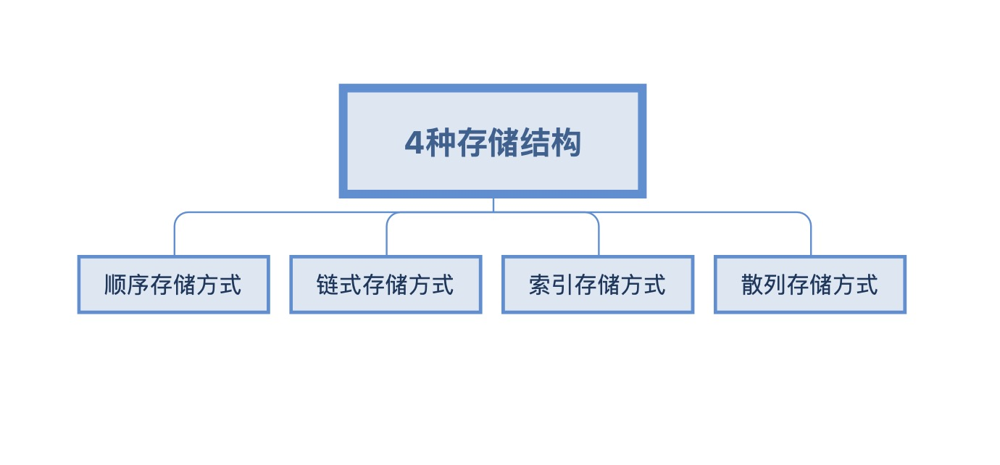

> 数据结构它不香吗?

# 引言

  ## 数据结构(Data structure)
  > 数据结构是计算机组织**组织数据**和**存储数据**的方式
  > 是指一组相互之间存在一种或多种特定关系的数据的**组织方式**和他们> 在计算机内的**存储方式**，以及定义在该组数据尚德**一组操作**

  ## 计算机解决问题的步骤
    1. 建立数据模型
    2. 设计算法
    3. 编程实现算法

  ## 数据的逻辑结构
  > 是指数据及数据的组织方式

  ## 数据结构，算法和程序的关系
  > 算法 + 数据结构 = 程序
  > (1976年瑞士计算机科学家尼克劳斯·维尔特[Niklaus Wirth]提出)

  ## 数据结构
    1. 数据的逻辑结构
    2. 数据的存储结构
    3. 数据的基本运算

# 基本概念和术语

  ## 数据(Data)
  > 所有能被计算机处理的**符号**的集合

  ## 数据元素(Data Element)
  > 是数据这个集合中的一个个体即数据的**基本单位**

  ## 数据项(Data Item)
  > 数据元素常常还可分为若干个数据项, 数据项是数据具有意义的**最小单位**

  ## 数据，数据元素，数据项构成了数据组织的3个层次
  > 数据库中，数据项又称为**字段/域**。它是数据的不可分割的**最小标识单位**。实际问题中的数据成为**原始数据**
  

  ## 逻辑结构(Logical Structure)
  > 指数据元素之间的结构关系
  
  1. 集合
  > 任意两个节点之间都**没有邻接关系**, 组织形式**松散**
  2. 线性结构
  > 节点按逻辑关系依次排列形成一条"**链**", 结点之间一个一个**依次相邻接**。
  3. 树状结构
  > 具有**分支，层次**特性，上层的结点可以和下层多个结点相邻，但下层结点只能和上层的一个结点相邻接。
  4. 图状结构 
  > **最复杂**，**任何**两个结点都可以**相邻接**。

  ## 物理结构(Physical Structure) / 存储结构
  > 指数据结构在机内的表示，数据的逻辑结构在计算机的实现
  
  1. 数据的存储结构
  > 数据在计算机内的表示形式
  2. 存储结构的主要部分
     1. 存储结点(每个存储结点存放一个数据元素)数据元素之间关联方式的表示
     2. 数据结构的存储 = 数据元素的存储 + 元素逻辑关系的存储
   
  ## 运算
  > 指在某种逻辑结构上施加操作, 即对逻辑结构的加工.
  > 加工型运算: 其操作改变原逻辑结构的值、
  > 引用型运算: 其操作不改变原逻辑结构的值.
  
  ### 基本运算
    1. 建立
    2. 查找
    3. 读取
    4. 插入
    5. 删除

# 算法及描述

# 算法分析
  ## 算法的设计应当满足
     1. 正确性：对于合法的输入产生符合要求的输出
     2. 易读性：算法应该易读，便于交流，这也是保证算法正确性的前提，添加注释也是一种增加可读性的办法。
     3. 健壮性：当输入非法数据时，算法还能做出适当的反应而不会崩溃，如输出错误信息，算法中应当考虑适当的错误处理。
     4. 时空性：指算法的时间复杂度,空间复杂度，算法分析主要分析算法的时间复杂度和空间复杂度，目的是提高算法的效率。
  ## 时间复杂度
  > 算法运行时需要的总步数，通常是问题规模的函数。
  ## 空间复杂度
  > 算法执行时所占用的存储空间，通常是问题规模的函数。